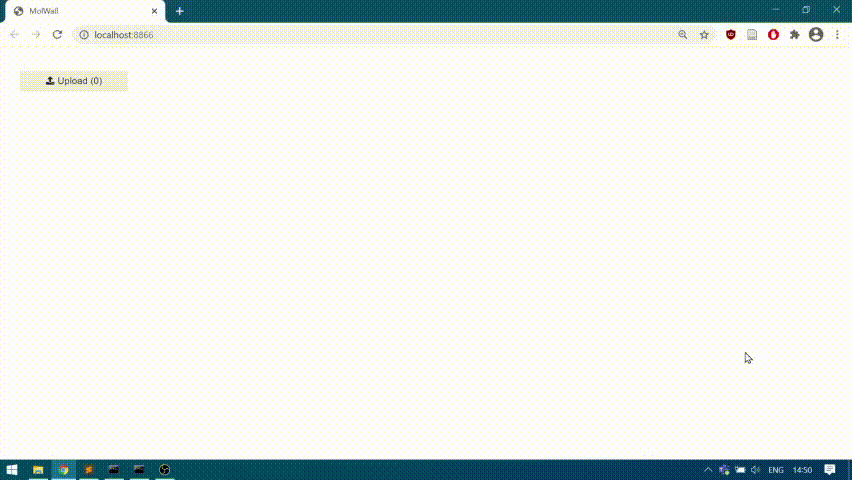

# mol-wall
GUI to show a "wall of molecules"



# Installation
Set up conda environment:
```shell
conda env create --file environment.yml
```

# Running
Run using Jupyter Voila:
```shell
conda activate molwall
voila notebooks/MolWall.ipynb
```